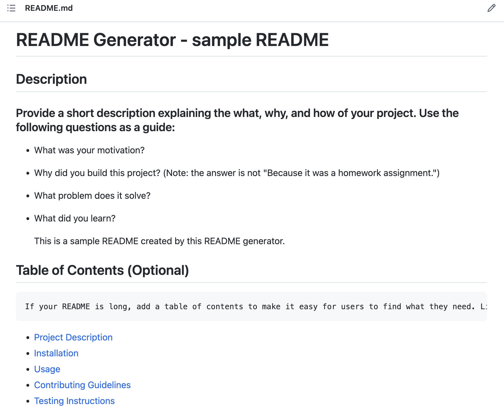

# README Generator - sample README

## Description <a name="description"/>
This is a command-line application that allows GitHub users to conveniently generate a professional README.md describing a project repository. You can find a sample README.md created using this application [here](sample_README.md).
  
## Table of Contents
- [README Generator - sample README](#readme-generator---sample-readme)
  - [Description ](#description-)
  - [Table of Contents](#table-of-contents)
  - [Installation ](#installation-)
  - [Usage  ](#usage--)
  - [How to Contribute ](#how-to-contribute-)
  - [Tests ](#tests-)
  - [Questions? ](#questions-)
  - [Sources for this project:](#sources-for-this-project)
  
## Installation <a name="installation"/>

Simply fork and clone the repo.
  
## Usage  <a name="usage"/>

Install Node.js in the root of repo. Then run `node index.js` in terminal. Make sure inquirer is included in dependencies under package.json. I use version 8.2.4 of the Inquirer package. 

Click screenshot demo to video link:

## How to Contribute <a name="contribute"/>

You can create a pull request or email me!
  
## Tests <a name="testing"/>

Installing Jest and writing js testing files is recommended. 
  
## Questions? <a name="questions"/>

Email: tinawang158@gmail.com or
Checkout my GitHub Profile [@tunaabop](https://github.com/tunaabop)

## Sources for this project:

[How to create a Professional README](https://coding-boot-camp.github.io/full-stack/github/professional-readme-guide)
  
